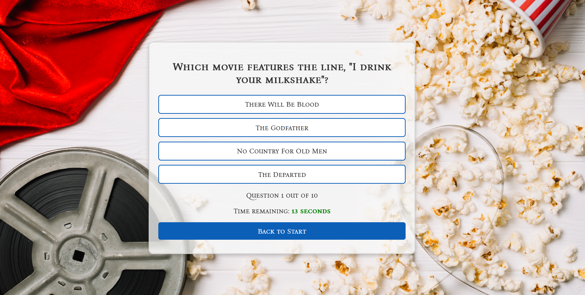

# 🎬 Movie Quiz
Test your knowledge in movies with this fun and interactive quiz!

## 🌍 Live Demo
Try out the quiz here: [Movie Quiz on Netlify](https://arvidsmoviequiz.netlify.app/)

## ✨ Features
### 🏠 Start Page
- A welcoming introduction with a visually appealing movie theme.
- "Start Quiz" button to begin the quiz.

### 🎥 Quiz Page
- Multiple-choice questions related to famous movies.
- A countdown timer for each question.
- "Back to Start" button to return to the main page.

### 🍿 Result Page
- View your final score
- Options to either restart quiz or go back to Start Page

## 🛠 Technologies Used
- **React** for building the interactive UI.
- **CSS3** for styling.
- **JavaScript** for quiz logic.
- **Netlify** for hosting the project.

## 🎨 Design Principles
### 🔳 CRAP Principles
- **Contrast:** Dark buttons on light backgrounds for readability.
- **Repetition:** Consistent font choices and button styles.
- **Alignment:** All elements are properly aligned for a structured layout.
- **Proximity:** Related elements are grouped together.

### 🌈 Color Scheme
- **Primary Colors:** Red, White, and Black.
- **Accent Colors:** Blue for quiz buttons.

### 🔠 Typography & Styling
- Elegant and readable fonts.
- Mix of serif and sans-serif fonts for a cinematic feel.
- Buttons styled with clear hover effects.

### 🎭 Icons & Graphics
- Movie reel and popcorn imagery for a strong thematic connection.
- Clapperboard icon for interactive elements.

### 📱 Responsiveness
- Media queries for different screen sizes.
- Mobile-friendly layout with touch-friendly buttons.

## 🖼 Preview
### Start Page

### Quiz Page

## 📖 How to Use
1. Visit the [Movie Quiz](https://arvidsmoviequiz.netlify.app/).
2. Click "Start Quiz" to begin.
3. Answer 10 multiple-choice questions.
4. View your results and try again!

Enjoy the quiz and challenge your movie knowledge! 🎥🍿